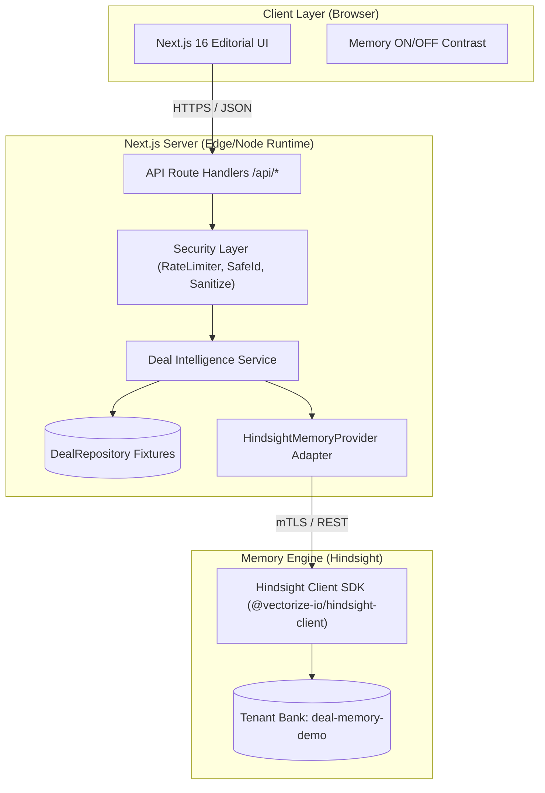
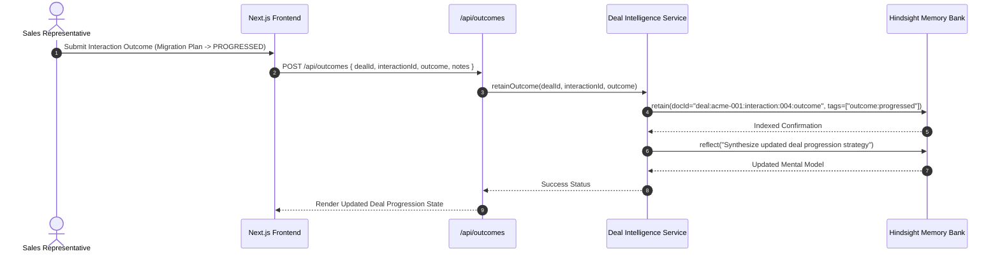
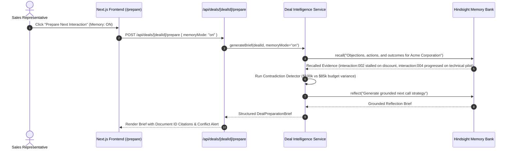

# System Architecture & Technical Specification — DealMemory

This document provides the authoritative architectural specification for DealMemory, explaining how user interfaces, Next.js server route handlers, domain repositories, and the [Hindsight Memory Engine](https://github.com/vectorize-io/hindsight) interact.

---

## 1. Product Thesis & Scope

### 1.1 The Problem
Traditional CRM AI generates isolated call summaries that decay immediately. Sales teams lose institutional memory across 6–9 month sales cycles:
- Reps forget which objections were raised previously.
- Reps repeat failed discount strategies instead of addressing root migration or compliance blockers.
- When reps transition or leaves a deal, context is lost.

### 1.2 The Solution
DealMemory bridges conversational transcripts, attempted actions, and real deal outcomes into a continuous learning loop:
$$\text{Conversation} \longrightarrow \text{Retained Memory} \longrightarrow \text{Action} \longrightarrow \text{Outcome} \longrightarrow \text{Consolidated Experience} \longrightarrow \text{Better Next Action}$$

### 1.3 Target Persona & Workflow
- **Target User**: B2B Enterprise Account Executive / Sales Representative.
- **Core Workflow**: Preparing for an upcoming customer interaction with actionable, evidence-backed strategy rather than generic advice.

---

## 2. High-Level System Architecture



---

## 3. Core Component Responsibilities

| Layer | Files | Responsibilities |
| :--- | :--- | :--- |
| **UI Presentation** | `src/app/`, `src/components/` | Editorial typography, responsive deal tables, timeline visualization, memory contrast toggle (ON/OFF), conflict alerts. Direct calls to Hindsight from browser are prohibited. |
| **Security & Routing** | `src/app/api/`, `src/lib/security/` | Zod schema validation (`SafeIdSchema`, `PrepareRequestSchema`), rate limiting (Sliding window token bucket), error masking, demo reset security. |
| **Domain Intelligence** | `src/lib/domain/`, `src/lib/fixtures/` | `DealIntelligenceService`, budget contradiction detection, evidence assembly, deterministic fixture repository. |
| **Memory Provider** | `src/lib/hindsight/` | `HindsightMemoryProvider`, bank-level isolation, deterministic document ID construction, XML delimiter escaping, retention, recall, and reflection. |

---

## 4. End-to-End Workflow Sequences

### 4.1 Ingestion & Outcome Learning Loop
When a sales rep completes an interaction and logs the outcome (e.g., offering a migration plan progressed the deal):



### 4.2 Preparation Brief Generation (Memory ON vs OFF)
When preparing for the next interaction with an account:



---

## 5. Hindsight Memory Taxonomy & Design

DealMemory implements a structured 3-tier memory taxonomy designed for multi-month sales transactions:

```
┌────────────────────────────────────────────────────────┐
│                   HINDSIGHT BANK                       │
│        (Scoped per Organization Tenant)                │
├────────────────────────────────────────────────────────┤
│ 1. WORLD MEMORY (Enterprise Context)                  │
│    - ICP Profiles, Competitor Playbooks, Pricing       │
├────────────────────────────────────────────────────────┤
│ 2. DEAL MEMORY (Account-Specific Episodes)            │
│    - Transcripts, Timelines, Stakeholders              │
├────────────────────────────────────────────────────────┤
│ 3. OBJECTION & OUTCOME MEMORY (Causal Links)           │
│    - Action: Discount 15% -> Outcome: STALLED          │
│    - Action: Migration Plan -> Outcome: PROGRESSED    │
└────────────────────────────────────────────────────────┘
```

### 5.1 Document ID Strategy
All retained documents use deterministic, idempotent document IDs to prevent duplicate memory poisoning:
- Deal Transcript: `deal:{dealId}:interaction:{interactionId}`
- Interaction Outcome: `deal:{dealId}:interaction:{interactionId}:outcome`
- Stakeholder Profile: `deal:{dealId}:stakeholder:{stakeholderId}`
- Deal Overview: `deal:{dealId}:overview`

### 5.2 Delimiter Escaping & AI Safety
Untrusted user inputs and meeting transcripts are escaped using `escapeXmlDelimiters()` to prevent prompt injection jailbreaks:
```typescript
export function escapeXmlDelimiters(text: string): string {
  return text
    .replace(/<\/sales_transcript_data>/g, '&lt;/sales_transcript_data&gt;')
    .replace(/<\/deal_context>/g, '&lt;/deal_context&gt;')
    .replace(/<\/system>/g, '&lt;/system&gt;');
}
```

---

## 6. Synthetic Evaluation Dataset

The platform seeds a realistic, deterministic multi-account dataset designed to exercise memory reasoning:

1. **Acme Corporation (`deal-acme-001`)**:
   - Stage: `technical-validation`
   - Value: $120,000 ARR
   - Narrative: 4 interactions. In interaction 2, the rep offered a 15% discount which stalled the deal. In interaction 4, a migration roadmap and technical proof progressed the deal.
   - Contradiction: Stakeholder Alice quoted $100k budget; Stakeholder Bob later cited $85k cap.
2. **Globex Industries (`deal-globex-002`)**:
   - Stage: `security-review`
   - Value: $250,000 ARR
   - Narrative: Security compliance, SOC 2, and data residency objections.
3. **Soylent Health (`deal-soylent-003`)**:
   - Stage: `closed-won`
   - Value: $80,000 ARR
   - Narrative: Successful closing sequence with clear procurement milestones.
