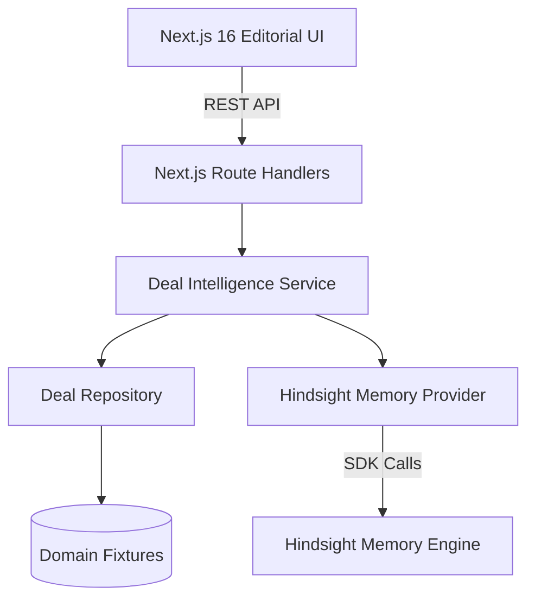
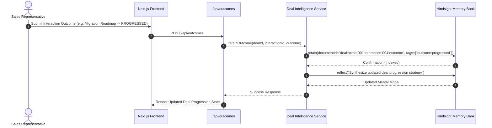
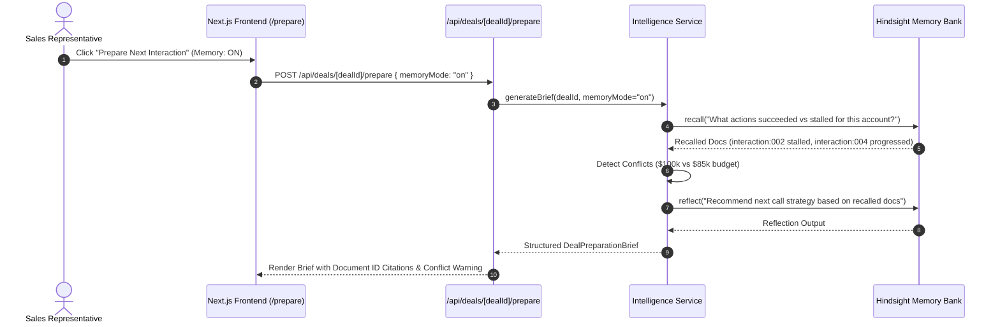

# System Design & Architecture Diagrams

This document illustrates the end-to-end data flow and architectural components of DealMemory.

## 1. High-Level Architecture

## 2. Ingestion & Outcome Learning Sequence

## 3. Preparation Generation with Evidence Linking

