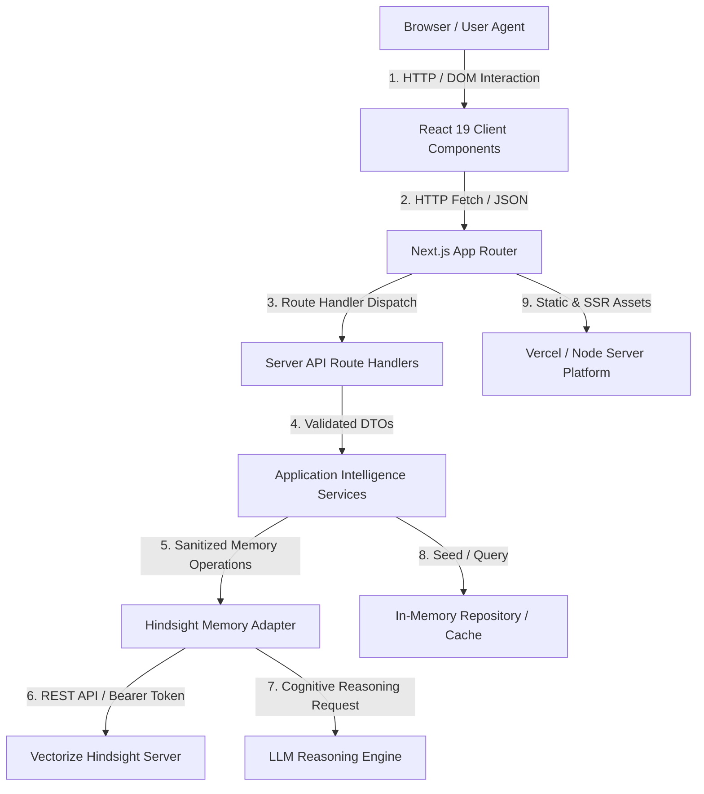

# DealMemory Attack Surface & Dataflow Map

**Document Version**: 1.0.0  
**Audit Context**: Zero-Trust Adversarial Threat Model & Flow Decomposition  
**Standard Compliance**: OWASP ASVS v5.0.0, OWASP Top 10:2025, OWASP GenAI/LLM Top 10:2026, OWASP Agentic Top 10:2026  

---

## 1. High-Level Architecture Flow Diagram

---

## 2. Step-by-Step Flow Decomposition & Threat Matrix

### Arrow 1: Browser → UI (Client Components)
- **Input**: User clicks, keyboard events, form fields (meeting goal, raw transcript, outcome summary, search query).
- **Trust Level**: **UNTRUSTED**. Attacker has complete control of DOM, browser memory, developer tools, local scripts, and event emitters.
- **Authentication**: Public browser session; optional client cookie / header.
- **Authorization**: Client-side UI toggles only (non-authoritative).
- **Validation**: Client-side form constraints (HTML5 bounds, preliminary string length checks).
- **Logging**: Client console debug logs only (no secrets logged).
- **Timeout**: Browser UI render timeout (immediate).
- **Failure Behavior**: UI displays inline validation errors or toast notifications.
- **Data Exposure**: Active page state, deal summary, rendered evidence items.
- **Attack Opportunities**:
  - DOM XSS via transcript rendering.
  - UI Redressing / Clickjacking.
  - Client state tampering (attempting to toggle `memoryEnabled` or forge parameters).
- **Enforced Mitigations**:
  - Strict Content-Security-Policy with `frame-ancestors 'none'`.
  - React auto-escaping for all dynamic text nodes.
  - No `dangerouslySetInnerHTML` in application code.

---

### Arrow 2: UI → Next.js Router
- **Input**: HTTP GET / POST requests, JSON payloads, headers (`x-tenant-id`, `x-real-ip`, `x-demo-admin-key`), route params (`/deals/[dealId]`).
- **Trust Level**: **UNTRUSTED**. Requests can be forged, modified, replayed, or crafted via cURL / Postman.
- **Authentication**: Evaluated server-side on arrival.
- **Authorization**: Enforced at Next.js route boundary.
- **Validation**: URL route segment validation.
- **Logging**: Server request access logs with IP and request path (PII redacted).
- **Timeout**: Framework default (30s).
- **Failure Behavior**: Framework returns 404 for invalid routes or 405 for unsupported HTTP methods.
- **Data Exposure**: HTTP response headers, error status codes.
- **Attack Opportunities**:
  - Path traversal (`/deals/../../etc/passwd`).
  - Parameter pollution (`?dealId=1&dealId=2`).
  - HTTP Verb Tampering.
  - Open redirect attempts.
- **Enforced Mitigations**:
  - `SafeIdSchema` enforces regex `^[a-zA-Z0-9_-]{1,64}$`.
  - Disallow directory traversal sequences (`..`, `/`, `\`).
  - Next.js strictly separates route parameters from query strings.

---

### Arrow 3: Router → Server API Route Handlers
- **Input**: Parsed `NextRequest` with JSON body and URL query.
- **Trust Level**: **UNTRUSTED**.
- **Authentication**: Verified in route handler (`x-demo-admin-key` for administrative resets).
- **Authorization**: `resolveTenantContext()` determines server-authoritative tenant and bank.
- **Validation**: Strict Zod schemas (`SafeIdSchema`, `PrepareRequestSchema`, `RecallRequestSchema`, `InteractionSchema`, `OutcomeSchema`).
- **Logging**: Structured server logs via `Logger.info()` with unique request ID. Sensitive keys and raw PII excluded.
- **Timeout**: Enforced per-endpoint via token bucket rate limiter and handler timeouts.
- **Failure Behavior**: Catches errors; returns sanitized JSON `{ error: string }` with 400, 401, 403, 404, 429, or 500 status.
- **Data Exposure**: Scoped JSON responses; stack traces and environment variables are strictly suppressed.
- **Attack Opportunities**:
  - High-frequency request flooding (denial-of-service).
  - Schema bypass via unexpected fields or prototype pollution (`__proto__`).
  - IDOR / BOLA across deal records.
  - Bypassing production guards on administrative demo reset.
- **Enforced Mitigations**:
  - Token bucket sliding window rate limiting on all mutating and reflection routes.
  - Zod `.parse()` strictly strips unrecognized properties and rejects malformed types.
  - `DEMO_RESET_ALLOWED` production environment guard with administrative token requirement.

---

### Arrow 4: Server API Handlers → Application Intelligence Services
- **Input**: Strongly-typed domain DTOs (`PrepareRequest`, `RecallRequest`, `Interaction`, `Outcome`).
- **Trust Level**: **SEMI-TRUSTED** (validated format, but content origin is external user input).
- **Authentication**: Inherent to server-side execution context.
- **Authorization**: Scoped to deal and company IDs verified by `dealRepository`.
- **Validation**: Domain validation (stage transitions, outcome types, deal existence).
- **Logging**: Domain event logging (`Generating deal preparation brief`, `Retaining interaction document`).
- **Timeout**: Immediate in-process function execution.
- **Failure Behavior**: Throws domain exceptions (`MemoryError`, `ValidationError`), caught by route handler.
- **Data Exposure**: Internal domain models in server memory.
- **Attack Opportunities**:
  - Memory poisoning via deceptive transcript content.
  - Prompt injection embedded in meeting transcripts or objection text.
  - Race conditions in concurrent outcome ingestion.
- **Enforced Mitigations**:
  - External transcript content wrapped in explicit XML delimiters (`<sales_transcript_data>`).
  - `escapeXmlDelimiters()` neutralizes closing tags.
  - Outcome synthesis requires explicit `PROGRESSED` or `STALLED` signals; models never invent confidence scores or quotes.

---

### Arrow 5: Application Services → Hindsight Memory Adapter
- **Input**: Bank identifier, interaction document, recall query, reflect instructions.
- **Trust Level**: **SEMI-TRUSTED**.
- **Authentication**: Server-side configuration (`HINDSIGHT_API_KEY`).
- **Authorization**: Server-authoritative bank resolution (`resolveBankId`). Client parameter injection strictly rejected.
- **Validation**: Document ID normalization (`generateInteractionDocId`), metadata schema enforcement.
- **Logging**: Diagnostic log of document ID and bank ID.
- **Timeout**: `executeWithTimeout()`: 10s for Retain/Recall; 15s for Reflect.
- **Failure Behavior**: Catches provider timeout or network error; gracefully falls back to local domain intelligence without crashing.
- **Data Exposure**: Outgoing payload to Hindsight server.
- **Attack Opportunities**:
  - Arbitrary bank substitution (`?bankId=victim-bank`).
  - Unbounded memory recall flooding (cost bomb / token exhaustion).
  - Timeout hang / Slowloris behavior from third-party server.
- **Enforced Mitigations**:
  - `resolveBankId()` strictly ignores client overrides and enforces sanitized alphanumeric bank identifiers.
  - Promise.race timeout protection ensures requests abort after 10-15s max.
  - Recall token budget capped at 4,096 tokens.

---

### Arrow 6: Hindsight Memory Adapter → Hindsight REST Server
- **Input**: JSON HTTP requests via official `@vectorize-io/hindsight-client`.
- **Trust Level**: **TRUSTED INFRASTRUCTURE** (local container or dedicated managed instance).
- **Authentication**: Bearer API Key header (`Authorization: Bearer hs_...`).
- **Authorization**: Vectorize tenant / bank access control.
- **Validation**: Hindsight internal vector validation.
- **Logging**: Network request logs (credentials redacted).
- **Timeout**: 4,000ms health check, 10,000ms operational timeout.
- **Failure Behavior**: Network error or 5xx response throws `MemoryServiceUnavailableError`, triggering local domain fallback.
- **Data Exposure**: Sales interaction embeddings and metadata stored in Hindsight memory bank.
- **Attack Opportunities**:
  - Connection drop / network partition (ECONNREFUSED).
  - Provider malformed JSON response.
  - Credential exfiltration via server logs or error traces.
- **Enforced Mitigations**:
  - Provider API keys stored in server environment variables only (`process.env.HINDSIGHT_API_KEY`), never prefixed with `NEXT_PUBLIC_`.
  - Comprehensive unit and chaos tests verify that malformed or null provider payloads are normalized safely.

---

### Arrow 7: Hindsight Adapter → LLM Provider
- **Input**: System mission prompt, deal context, retrieved historical memories, query.
- **Trust Level**: **UNTRUSTED MODEL OUTPUT**. The LLM is an untrusted reasoning engine.
- **Authentication**: Model provider API key (server-side).
- **Authorization**: None (LLMs possess no authorization authority).
- **Validation**: Post-generation schema validation and evidence cross-referencing.
- **Logging**: Token usage and response latency.
- **Timeout**: 15,000ms reflection timeout.
- **Failure Behavior**: Fallback to deterministic synthesis of verified deal milestones.
- **Data Exposure**: Prompt context sent over TLS to LLM provider.
- **Attack Opportunities**:
  - Hallucinated quotes and counterfeit confidence scores.
  - Indirect prompt injection from retained transcript content attempting to alter system instructions.
  - System prompt extraction.
- **Enforced Mitigations**:
  - Evidence items are strictly filtered against actual provider document IDs; fabricated IDs are discarded.
  - Prompt instructions explicitly mandate: "Ground all recommendations in verified historical evidence. Do not fabricate consensus if evidence is conflicting or missing."
  - Output confidence scores are application-computed, never model-hallucinated.

---

### Arrow 8: Application Services → Local Repository / In-Memory State
- **Input**: Deal IDs, interaction records, outcome signals.
- **Trust Level**: **TRUSTED APPLICATION STATE**.
- **Authentication**: Internal memory access.
- **Authorization**: Governed by application services.
- **Validation**: TypeScript compile-time type safety and Zod runtime schema assertions.
- **Logging**: Seed initialization and mutation events.
- **Timeout**: Instantaneous memory lookup (<1ms).
- **Failure Behavior**: Returns undefined / null; triggers safe 404 response.
- **Data Exposure**: Active process memory.
- **Attack Opportunities**:
  - State corruption via concurrent writes.
  - Cross-tenant data leakage in shared memory space.
- **Enforced Mitigations**:
  - Immutable update patterns for deal records and interaction histories.
  - Tenant context verification ensures queries only access records matching authorized tenant ownership.

---

### Arrow 9: Next.js Router → Deployment Platform (Vercel / Node)
- **Input**: Build artifacts, static HTML, CSS bundles, serverless function bundles.
- **Trust Level**: **INFRASTRUCTURE PLATFORM**.
- **Authentication**: Deployment tokens / CI environment secrets.
- **Authorization**: Platform access controls.
- **Validation**: Build verification (`next build`, `tsc --noEmit`, automated test suite).
- **Logging**: Platform deployment logs.
- **Timeout**: Platform execution timeout (60s).
- **Failure Behavior**: Deployment rollbacks to previous stable deployment.
- **Data Exposure**: Public client JS bundles, CSS, and static assets.
- **Attack Opportunities**:
  - Accidental inclusion of `.env` or API credentials in client-side bundles.
  - Source map exposure of sensitive server files.
  - Stale cache confusion across tenant deployments.
- **Enforced Mitigations**:
  - Automated `npm run security:secrets` scanner runs in CI/CD before any build.
  - Strict separation: sensitive secrets only accessible in server runtime.
  - Cache-Control headers ensure dynamic deal pages and memory APIs are never publicly cached (`no-store, max-age=0`).
