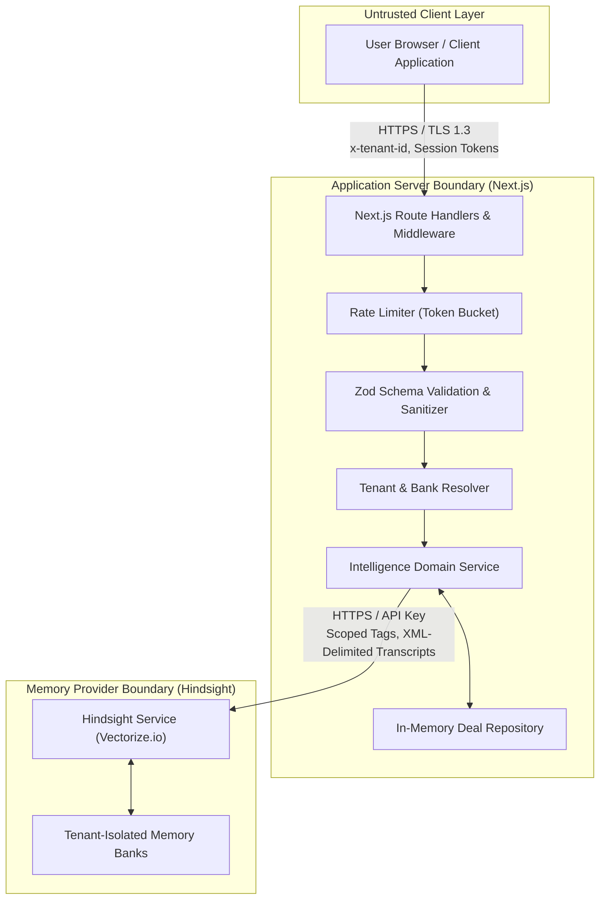

# DealMemory Data Flow & Boundary Specification

## Overview
This document specifies the exact flow of data through DealMemory, detailing protocols, trust boundaries, encryption in transit, and sensitivity levels across all system components.

---

## Data Flow Stages

### 1. User Ingestion (Browser → Application Server)
- **Data Transmitted**: Meeting transcripts, interaction summaries, sales actions attempted, observed prospect outcomes, filter parameters, and deal IDs.
- **Protocol**: HTTPS (TLS 1.3 enforced via HSTS).
- **Authentication**: Session cookie or `x-tenant-id` header.
- **Sensitivity**: **HIGH (Confidential)**. Contains customer sales discussions, pricing numbers, and prospect names.
- **Controls**:
  - Request rate limiting enforced by IP.
  - Zod schema validation checks format and caps lengths (transcript max 50k chars).
  - Null bytes and non-printable control characters are stripped.

### 2. Context & Bank Resolution (Application Server Internal)
- **Data Transmitted**: Tenant ID, resolved Bank ID.
- **Boundary**: Internal server memory.
- **Controls**:
  - Client-supplied `bankId` parameters are stripped and discarded.
  - Bank ID is deterministically resolved from verified tenant context.

### 3. Memory Retention (Application Server → Hindsight)
- **Data Transmitted**:
  - Structured document ID: `deal:{dealId}:interaction:{interactionId}`
  - Scoped tags: `deal:{dealId}`, `company:{companyId}`, `stage:{stage}`
  - Sanitized content: `<sales_transcript_data>{escaped_dialogue}</sales_transcript_data>`
- **Protocol**: HTTP/HTTPS with `HINDSIGHT_API_KEY` bearer authentication.
- **Sensitivity**: **HIGH**.
- **Controls**:
  - Closing XML delimiters are escaped (`&lt;/sales_transcript_data&gt;`).
  - Timeout bounded to 10,000ms.

### 4. Memory Recall & Reflection (Application Server ↔ Hindsight)
- **Data Transmitted**:
  - Query string: Bounded to 1,000 characters.
  - Scoped tags filter: strictly locked to `deal:{dealId}`.
- **Returned Data**:
  - Evidence items: Fact text, document IDs, timestamps, confidence scores.
  - Reflect synthesis: Reasoning text and structured recommendations.
- **Controls**:
  - Bounded timeout: 10,000ms recall, 15,000ms reflect.
  - If Hindsight returns an error or empty result, `IntelligenceService` falls back to synthesizing verified local repository outcomes.

### 5. Client Response (Application Server → Browser)
- **Data Transmitted**: Clean `DealPreparationBrief` JSON.
- **Sensitivity**: **MEDIUM (Derived Intelligence)**.
- **Controls**:
  - Server secrets, upstream LLM prompts, and raw API keys are never included in the JSON payload.
  - Rendered safely as plain text in the UI without `dangerouslySetInnerHTML`.
